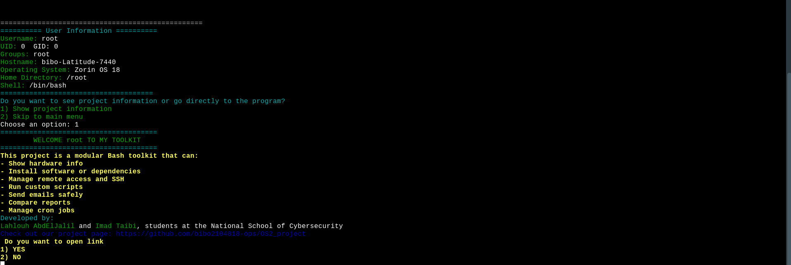
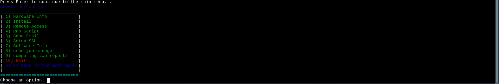
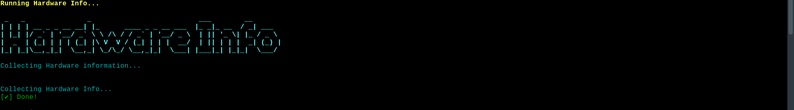
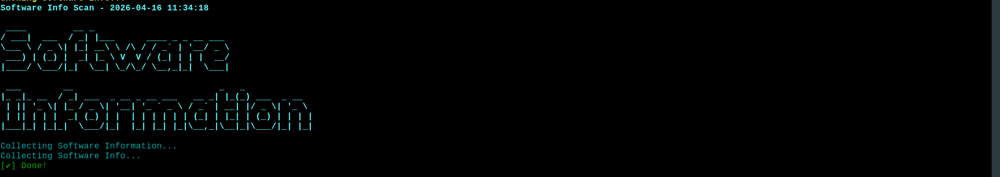

# 🛡️ OS2 Project — Linux System Audit and Monitoring

> An automated Linux audit and monitoring system built with Bash shell scripting,
> developed as part of the Operating Systems 2 course at the National School of Cyber Security (NSCS).

---

## 📋 Table of Contents

- [Academic Information](#-academic-information)
- [Project Overview](#-project-overview)
- [Project Idea](#-project-idea)
- [Objectives](#-objectives)
- [Technologies Used](#️-technologies-used)
- [Features](#-features)
- [Configuration](#️-configuration)
- [Installation](#-installation)
- [Usage](#-usage)
- [Screenshots](#-screenshots)
- [Project Structure](#️-project-structure)
- [Authors](#-authors)

---

## 🎓 Academic Information

| Field            | Details                                      |
|------------------|----------------------------------------------|
| **Course**       | Operating Systems 2 (SYST 2)                 |
| **Institution**  | National School of Cyber Security (NSCS)     |
| **Academic Year**| 2025 / 2026                                  |
| **Instructor**   | Dr. BENTRAD Sassi                            |
| **Students**     | Promotion 2                                  |

---

## 📌 Project Overview

This project is part of the **Operating Systems 2 (SYST 2)** course at the National School of Cyber Security.

The objective is to design and implement an **automated Linux audit and monitoring system** using shell scripting. The system collects hardware and software information, generates structured reports, and supports automation and remote monitoring.

---

## 💡 Project Idea

### 🇬🇧 English

This project was proposed by the instructor to highlight the importance of system auditing in Cybersecurity.

In modern computing environments, understanding both hardware and software configurations is essential for:

- Risk assessment
- Vulnerability management
- Incident response

Manual system auditing is often inefficient and error-prone. For this reason, the project focuses on automating these tasks using Linux shell scripting.

The main idea is to design and implement an automated solution capable of:

- Collecting detailed system information
- Monitoring system activity
- Generating structured reports
- Supporting security analysis and system management

This project reflects real-world tasks performed by system administrators and cybersecurity analysts, making it both practical and relevant.

---

### 🇫🇷 Français

Ce projet a été proposé par l'enseignant afin de mettre en évidence l'importance de l'audit des systèmes en cybersécurité.

Dans les environnements informatiques modernes, la compréhension des configurations matérielles et logicielles est essentielle pour :

- L'évaluation des risques
- La gestion des vulnérabilités
- La réponse aux incidents

L'audit manuel des systèmes est souvent inefficace et sujet aux erreurs. C'est pourquoi ce projet se concentre sur l'automatisation de ces tâches à l'aide de scripts shell sous Linux.

L'objectif principal est de concevoir et de développer une solution automatisée capable de :

- Collecter des informations détaillées sur le système
- Surveiller l'activité du système
- Générer des rapports structurés
- Aider à l'analyse de sécurité et à la gestion du système

Ce projet reflète des tâches réelles effectuées par les administrateurs systèmes et les analystes en cybersécurité, ce qui le rend pratique et pertinent.

---

## 🎯 Objectives

The system is designed to:

- Collect detailed **hardware information**
- Collect **software and OS information**
- Generate **formatted reports** (short and detailed)
- Send reports via **email**
- **Automate** execution using cron jobs
- Support **remote monitoring** via SSH

---

## ⚙️ Technologies Used

| Category  | Details                          |
|-----------|----------------------------------|
| **OS**    | Linux (Ubuntu / Kali / etc.)     |
| **Language** | Bash (Shell Scripting)        |
| **Tools** | `cron`, `SSH`, mail utilities    |

---

## 🚀 Features

### 1. Hardware Audit

Retrieves detailed information about the machine's hardware components, including:

- CPU information (model, cores, architecture)
- GPU (if available)
- RAM details (total and available memory)
- Disk information (size, partitions, usage, filesystem type)
- Network interfaces
- MAC and IP addresses
- Motherboard information and other relevant hardware details
- USB devices

---

### 2. Operating System & Software Audit

Extracts comprehensive information about the OS and installed software, including:

- OS name and version
- Kernel version
- System architecture
- Installed packages
- Logged-in users
- Running services and active processes
- Open ports
- And more

---

### 3. Reporting System

Generates two report types:

- **Short Report** — summary overview
- **Full Report** — detailed breakdown

**Supported formats:**

```text
.txt  /  .html  /  .json  /  .pdf
```

Each report includes:

- Date & time
- Hostname
- Structured sections

---

### 4. Email Reporting

- Sends reports via email automatically
- Configurable recipient address
- Supported tools: `mail`, `mailx`, `sendmail`, `mutt`

---

### 5. Automation

- Cron scheduling (e.g., daily at 04:00 AM)
- Execution logging
- Error handling

---

### 6. Remote Monitoring

- Monitoring via SSH
- Secure remote access
- Centralized reporting

---

## 🛠️ Configuration

### Email Configuration — `email.conf`

Edit the following fields in `config/email.conf`:

```bash
user = "example@gmail.com"      # Replace with your Gmail address
from = "example@gmail.com"      # Replace with your Gmail address
password = "your_app_password"  # Replace with your Gmail App Password (see below)
```

> ⚠️ **WARNING:** Never enter your real Google account password here.
> Only use an **App Password** generated specifically for this application.

---

### Email Configuration — `email.conf_2`

Edit the following fields in `config/email.conf_2`:

```bash
set realname="Your Name"              # Replace with your name
set from="example@gmail.com"          # Replace with your Gmail address
```

---

### 🔑 Generating a Gmail App Password

App Passwords only work when **2-Step Verification** is enabled on your Google account.

**Step 1 — Enable 2-Step Verification:**

1. Go to your Google Account security settings:
   ```
   https://myaccount.google.com/security
   ```
2. Find **"2-Step Verification"** and click it.
3. Follow the steps to activate it (phone number, SMS code, etc.).

**Step 2 — Generate the App Password:**

1. Go to:
   ```
   https://myaccount.google.com/apppasswords
   ```
2. Sign in again if prompted.
3. Under **"Select app"**, choose: `Mail`.
4. Under **"Select device"**, choose your device (or select `Other` and type a name like `MyPC`).
5. Click **Generate**.
6. Google will display a 16-character password, for example:
   ```
   azed oiun hdgy tefd
   ```
7. Copy it **without spaces** and paste it into the `password` field:
   ```
   azedoiunhdgytefd
   ```

> ⚠️ **Important Notes:**
> - This password is shown **only once** — save it immediately.
> - **Do NOT share it** with anyone.
> - You can revoke it at any time from the same page.
> - It is used for applications that do not support modern Google login (OAuth).

---

## 📦 Installation

### Hardware Audit Script (`hardware_info.sh`)

```bash
sudo apt install -y \
  util-linux pciutils usbutils dmidecode lm-sensors \
  iproute2 ethtool pandoc texlive-xetex \
  texlive-fonts-recommended texlive-latex-extra \
  gawk sed grep coreutils procps net-tools

sudo sensors-detect
# Answer YES to all prompts (recommended)
```

---

### Software Audit Script (`software_info.sh`)

```bash
sudo apt install -y \
  procps iproute2 net-tools psmisc coreutils \
  gawk sed grep util-linux hostname systemd \
  pandoc texlive-xetex texlive-fonts-recommended \
  texlive-latex-extra
```

---

### File Comparison Tool (`comparing_report.sh`)

```bash
sudo apt install -y \
  diffutils coreutils grep findutils gawk sed
```

---

### Script Scheduler Tool (`cron_script.sh`)

```bash
sudo apt install -y \
  cron coreutils grep sed gawk util-linux

sudo systemctl enable cron
sudo systemctl start cron
```

---

### Email Sender Tool (`send_email.sh`)

```bash
sudo apt install -y mutt
sudo apt install -y msmtp msmtp-mta
sudo apt install -y mailutils
```

---

### Remote Audit Tool & SSH Setup (`remote_access.sh` / `setup_ssh.sh`)

```bash
sudo apt install -y openssh-client openssh-server coreutils
```

---

## 💻 Usage

Run the main script to launch the audit tool:

```bash
bash scripts/main.sh
```

Or use the runner script:

```bash
bash scripts/run.sh
```

To schedule automated audits with cron:

```bash
bash scripts/cron_script.sh
```

To send a report by email:

```bash
bash scripts/send_email.sh
```

To run a remote audit via SSH:

```bash
bash scripts/remote_access.sh
```

---

## 📸 Screenshots

**Main Menu**



---

**Main Menu — Project Information**



---

**Hardware Audit**



---

**Software Audit**



---

## 🗂️ Project Structure

```text
OS2_project-main/
├── config/
│   ├── email.conf
│   └── email.conf_2
├── generators/
│   ├── generate_doc.sh
│   └── generate_pdf.sh
├── scripts/
│   ├── collected_report/
│   │   ├── _2026-03-19/
│   │   │   ├── hardware_full_report.txt
│   │   │   ├── hardware_short_report.txt
│   │   │   └── integrity_hashes.txt
│   │   └── _2026-03-20/
│   │       ├── hardware_full_report.txt
│   │       ├── hardware_short_report.txt
│   │       ├── integrity_hashes.txt
│   │       ├── software_full_report.txt
│   │       └── software_short_report.txt
│   ├── output/
│   │   ├── full_hardware_info.txt
│   │   ├── hardware_info_20260303_034458.pdf
│   │   ├── hardware_info_20260303_034650.pdf
│   │   ├── hardware_report.pdf
│   │   └── temp/
│   │       └── hardware_info.txt
│   ├── comparing_report.sh
│   ├── cron_script.sh
│   ├── hardware_info.sh
│   ├── install.sh
│   ├── main.sh
│   ├── remote_access.sh
│   ├── run.sh
│   ├── send_email.sh
│   ├── setup_ssh.sh
│   └── software_info.sh
├── difficulties_faced.txt
└── README.md
```

---

## 👥 Authors

This project was developed by:

**Lahlouh AbdElJalil**
- GitHub: [bibo2104818-ops](https://github.com/bibo2104818-ops)
- Email: bibo2104818@gmail.com

**Imad Taibi**
- GitHub: [imadtaibi573-design](https://github.com/imadtaibi573-design)
- Email: imadtaibi573@gmail.com

> Students at the **National School of Cybersecurity (NSCS)**

---

## 🔗 Project Repository

```
https://github.com/bibo2104818-ops/OS2_project.git
```

---

*© 2025–2026 — National School of Cyber Security (NSCS) — Operating Systems 2 Project*